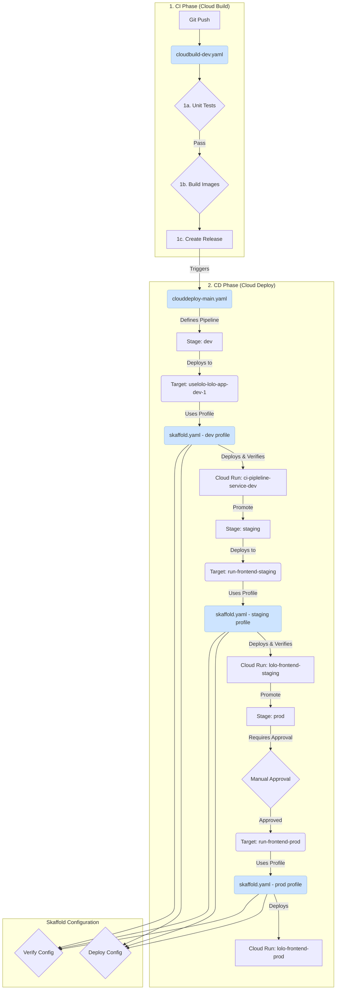

# Lolo Frontend Deploy Pipeline Definition

## The Workflow in Action

1. Your `git push` will fire the Cloud Build Trigger.
2. Cloud Build will run the steps in `cloudbuild.yaml`.
3. It will build and push your image to Artifact Registry, tagged with the **commit SHA**.
4. It will create a new release in Cloud Deploy named `rel-${SHORT_SHA}`.
5. Cloud Deploy will see this new release and automatically deploy it to the `dev` target. The `my-app-dev` Cloud Run service will be created or updated.
6. Go to the Cloud Deploy dashboard. You will see your pipeline, the new release, and its successful deployment to `dev`.
7. The pipeline will show the `prod` stage as "Pending Approval" (because we set `requireApproval: true`).
8. Click "Promote" and then "Approve" the deployment to `prod`.
9. Cloud Deploy will now deploy that exact same image to your `prod` target, updating the `my-app-prod` service.

## Diagram of the Workflow

